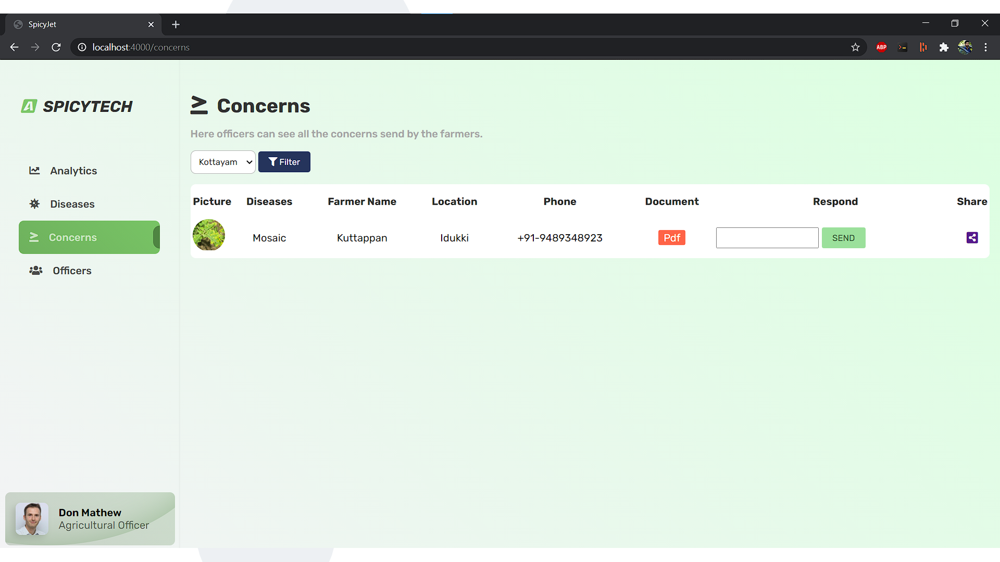

# VAIGA AGRI HACK 2021 Title wining mobile application
## PLANT DISEASE DETECTION MOBILE APPLICATION BY TEAM SPICYTECH
# MOBILE APP
This mobile Application helps farmers to scan plants and detect diseases and pest using Machine Learning. This Ai powered app instantly gives remedies and medicines for detected disease. If farmer have any concern, they can acknowledge agriculture officers through this app.

# WEB SITE
To manage queries there is a dedicated website built for agricultural department

## TECHNOLOGIES USED
1. Flutter Mobile App
2. Nodejs Website
3. TensorFlow and keras for Machine Learning
4. Heroku and Fire base for deployment
5. Flask for API

Artificial Intelligence
Due to lack of image datasets for native plants of Kerala we collected image dataset own our own
The AI model is created using a technique called Transfer Learning using InceptionV3 neural network

### Support or Contact
